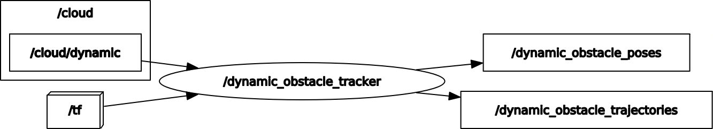

# dynamic_obstacle_tracker

ROS package for tracking dynamic obstacles


## Environment
- Ubuntu 20.04
- ROS Noetic

## Dependencies
- [dynamic_cloud_detector](https://github.com/amslabtech/dynamic_cloud_detector)

## Install and Build
```
cd /path/to/your/catkin_ws/src
git clone https://github.com/amslabtech/dynamic_obstacle_tracker.git
rosdep install -riy --from-paths . --rosdistro noetic            # Install dependencies
catkin build dynamic_obstacle_tracker -DCMAKE_BUILD_TYPE=Release # Release build is recommended
```

## How to use
```
roslaunch dynamic_obstacle_tracker dynamic_obstacle_tracker.launch
```

## Node I/O


### Runtime requirement
TF (from the frame id of cloud to the global frame id) is required

## Nodes
### dynamic_obstacle_tracker
#### Published Topics
- /dynamic_obstacle/poses (`geometry_msgs::PoseArray`)
  - Poses of dynamic obstacles
- /dynamic_obstacle/trajectories (`visualization_msgs::MarkerArray`)
  - Trajectories of dynamic obstacles

#### Subscribed Topics
- /cloud/dynamic (`sensor_msgs/PointCloud2`)
  - Dynamic cloud

#### Parameters
- ~\<name>/<b>global_frame</b> (string, default: `map`):<br>
  The global frame id
- ~\<name>/<b>min_dist_th</b> (float, default: `1.0` [m]):<br>
  The minimum distance threshold for tracking
